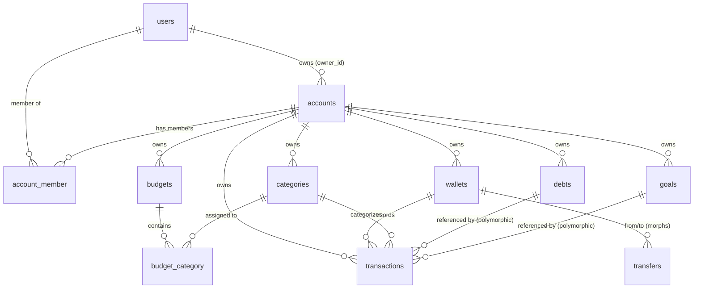

# DINERO — AI Agent & Developer Architectural Guide (`README.AI.md`)

> **Note for AI Agents & Developers:**  
> This file is a complete, exhaustive reference for the **Dinero** codebase. It covers domain architecture, data structures, model lifecycles, UI components, quirks, and exact file paths so you **do not need to perform exploratory code searches**.

---

## 1. Project Overview & Quick Reference

- **Project Name:** Dinero
- **Repository URL:** [https://github.com/Shipu/dinero](https://github.com/Shipu/dinero)
- **Primary Purpose:** A multi-account (multi-tenant) personal & business money tracker. Tracks wallets, categories, transactions, periodic budgets, financial goals, and debts.
- **Tech Stack:**
  - **Framework:** Laravel 10.x (`laravel/framework` ^10.10)
  - **PHP Version:** PHP 8.1+ (Tested & running on PHP 8.4 cli)
  - **Admin UI / Panel:** Filament PHP v3.2 (`filament/filament` ^3.0, `filament/notifications` ^3.0)
  - **Frontend / Styling:** Tailwind CSS v3.3, Vite 4, Livewire 3
  - **Wallet Engine:** `bavix/laravel-wallet` v10.0
  - **Charts:** `leandrocfe/filament-apex-charts` v3.0
  - **Profile & 2FA:** `jeffgreco13/filament-breezy` v2.1.1
  - **Icon Packages:** `guava/filament-icon-picker`, `blade-ui-kit/blade-icons`, `mallardduck/blade-lucide-icons`
  - **Currencies & Countries:** `rinvex/countries`, `akaunting/laravel-money`
  - **Model Lifecycle Hooks:** `shipu/watchable` (`WatchableTrait`)
  - **Slug Management:** `cviebrock/eloquent-sluggable`

### Quick Credentials & URLs
- **Root URL:** `http://localhost:8000/` (Redirects automatically to `/{tenant}` or `/login`)
- **Login URL:** `http://localhost:8000/login`
- **Register URL:** `http://localhost:8000/register`
- **Default User:** `demo@dinero.app`
- **CRITICAL PASSWORD NOTE:**
  - In `Login.php` (local env pre-fill) and public `README.md`, password is listed as `12345678`.
  - In `UserSeeder.php` / currently seeded `database/database.sqlite`, the password hash is **`password`**!
  - If login fails with `12345678`, use **`password`** or update the hash in DB.

---

## 2. Directory Tree & Key File Map

```
D:\Rafy\www\dinero
├── app/
│   ├── Console/
│   │   └── Kernel.php                     # Schedules 15-minute migrate:fresh if APP_DEMO=true
│   ├── Enums/                             # Domain Enums (see Section 3.8)
│   │   ├── BudgetPeriodEnum.php           # weekly, monthly, quarterly, yearly
│   │   ├── DebtActionTypeEnum.php         # repayment, debt_increase, debt_interest, loan_increase, etc.
│   │   ├── DebtTypeEnum.php               # payable, receivable
│   │   ├── MonthEnum.php                  # Months 1-12
│   │   ├── QuarterEnum.php                # Quarters 1-4
│   │   ├── RecurringTypeEnum.php          # none, daily, weekly, monthly, yearly
│   │   ├── SpendTypeEnum.php              # income, expense
│   │   ├── TransactionTypeEnum.php        # deposit, withdraw, transfer, payment
│   │   ├── TransferStatusEnum.php         # transfer, paid, refund, gift
│   │   ├── VisibilityStatusEnum.php       # active, inactive
│   │   ├── WalletTypeEnum.php             # general, credit_card
│   │   └── WeekdayEnum.php                # Sunday - Saturday
│   ├── Filament/                          # Filament Admin Panel Resources & Pages
│   │   ├── Pages/
│   │   │   ├── Auth/
│   │   │   │   ├── Login.php              # Custom login page; auto-fills demo credentials in local
│   │   │   │   └── Register.php           # User registration page (/register)
│   │   │   ├── Dashboard.php              # Hub dashboard hosting ApexCharts & latest transactions
│   │   │   └── Tenancy/
│   │   │       ├── EditAccountProfile.php # Tenant profile edit (Account info)
│   │   │       └── RegisterAccount.php    # Tenant registration (/register-account)
│   │   ├── Resources/
│   │   │   ├── BudgetResource.php         # Budget management & table
│   │   │   ├── CategoryResource.php       # Category management with ordering & icon picker
│   │   │   ├── DebtResource.php           # Debt & loan tracking with transaction actions
│   │   │   ├── GoalResource.php           # Financial goals with deposit/withdraw actions
│   │   │   ├── TransactionResource.php    # Core income/expense/transfer/payment resource
│   │   │   └── WalletResource.php         # General & credit card wallet resource
│   │   └── Widgets/
│   │       ├── CategoryChart.php          # ApexChart: Top 10 Category Withdrawals (last 10 days)
│   │       ├── LatestTransaction.php      # Table widget: Last 5 transactions
│   │       └── TransactionChart.php       # ApexChart: Stacked Bar of Deposits vs Withdrawals (last 10 days)
│   ├── Models/
│   │   ├── Account.php                    # Tenant model (ULID primary key)
│   │   ├── AccountMemberInvitation.php    # Account invitation stub
│   │   ├── Budget.php                     # Budget entity
│   │   ├── BudgetCategory.php             # Pivot model for budget_category
│   │   ├── Category.php                   # Income/Expense categories
│   │   ├── Debt.php                       # Payables & Receivables
│   │   ├── Goal.php                       # Savings goals
│   │   ├── Member.php                     # Pivot model for account_member (User <-> Account)
│   │   ├── Recurring.php                  # Recurring model (future automation stub)
│   │   ├── Transaction.php                # Extends Bavix\Wallet\Models\Transaction
│   │   ├── User.php                       # User model, Authenticatable, FilamentUser, HasTenants
│   │   └── Wallet.php                     # Extends Bavix\Wallet\Models\Wallet
│   ├── Providers/
│   │   ├── Filament/
│   │   │   └── AdminPanelProvider.php     # Panel configuration (id: 'hub', tenancy, colors, plugins)
│   │   ├── AppServiceProvider.php
│   │   ├── AuthServiceProvider.php
│   │   ├── EventServiceProvider.php
│   │   └── RouteServiceProvider.php
│   ├── Support/
│   │   └── helpers.php                    # Global helper functions (currency, country, month ordinals)
│   ├── Tables/
│   │   └── Columns/IconColorColumn.php    # Custom Filament table column rendering colored icon badge
│   └── Transformer/                       # DTO transformers for Bavix Wallet
│       ├── FilamentTransactionDtoTransformer.php # Injects account_id, category_id, happened_at
│       └── FilamentTransferDtoTransformer.php    # Injects account_id
├── config/
│   ├── filament.php                       # Filament settings (disk, broadcasting)
│   ├── icon-picker.php                    # Guava IconPicker config (heroicons, fontawesome, lucide)
│   ├── wallet.php                         # Bavix Wallet package overrides (models, transformers)
│   └── ...
├── database/
│   ├── database.sqlite                    # Active local SQLite database
│   ├── factories/UserFactory.php          # User factory
│   ├── migrations/                        # Database migration files (see Section 4)
│   └── seeders/                           # Seeders (DatabaseSeeder, UserSeeder, AccountSeeder, etc.)
├── lang/
│   ├── en/                                # Fallback translation files (English)
│   └── id/                                # Default locale translation files (Bahasa Indonesia)
├── resources/
│   ├── views/
│   │   ├── banner.blade.php               # Demo mode banner
│   │   ├── tables/columns/
│   │   │   └── icon-color-column.blade.php# View for IconColorColumn
│   │   └── vendor/filament-panels/
│   │       └── components/logo.blade.php  # Dinero custom branding logo
├── routes/
│   ├── api.php                            # Sanctum auth check route
│   ├── console.php                        # Console closures
│   └── web.php                            # Empty; all web routes are dynamically registered by Filament
├── tests/
│   ├── Feature/ExampleTest.php            # Asserts GET / returns 200 (Note: fails out-of-box due to 302 redirect)
│   └── Unit/ExampleTest.php               # Basic assertion test
```

---

## 3. Domain & Architecture Deep Dive

### 3.1 Multi-Tenancy Architecture
- **Tenant Model:** `App\Models\Account`
- **Tenant Key:** ULID (`HasUlids`), e.g., `01KYQ2DSRHXJPZSA1ERJ2KER83`.
- **Tenant URL Structure:** All authenticated resource routes are scoped under the tenant slug:
  - `/{tenant}` -> Dashboard
  - `/{tenant}/wallets`
  - `/{tenant}/categories`
  - `/{tenant}/budgets`
  - `/{tenant}/goals`
  - `/{tenant}/debts`
  - `/{tenant}/transactions`
- **Root Redirection:** Visiting `/` executes `Filament\Http\RedirectToTenantController`, which redirects (302) to the user's default/latest tenant (`/{tenant}`) or `/login`.
- **Tenant Ownership & Scoping:**
  - `Account` belongs to an owner (`User` via `owner_id`).
  - `Account` can have multiple members via `account_member` table (`Member` pivot).
  - All domain models (`Wallet`, `Category`, `Transaction`, `Budget`, `Debt`, `Goal`) have an `account_id` foreign key and implement a `scopeTenant($query)` method:
    ```php
    public function scopeTenant(Builder $query): Builder
    {
        return $query->where('account_id', optional(Filament::getTenant())->id);
    }
    ```

### 3.2 Wallet System (`bavix/laravel-wallet`)
- **Model:** `App\Models\Wallet` (extends `Bavix\Wallet\Models\Wallet`).
- **Holder:** The `User` is the polymorphic holder (`holder_type = App\Models\User`, `holder_id = user_id`).
- **Wallet Types (`WalletTypeEnum`):**
  1. `general`: Cash, Bank Accounts, Mobile Wallets.
  2. `credit_card`: Credit Cards with billing cycles.
- **Credit Card Specific Fields:**
  - `statement_day_of_month` (1-31): Monthly billing date.
  - `payment_due_day_of_month` (1-31): Payment deadline date.
  - `meta['credit']`: Total credit limit.
  - `meta['total_due']`: Initial balance due on creation.
- **Currency & Precision:**
  - Currencies are configured per wallet (e.g. `BDT`, `USD`, `EUR`).
  - Balances are stored in integer subunits (cents / multiplied by 100) using a `decimal(64, 0)` column.
  - For display and calculation, use `balance_float` (divided by 100).
- **Creation Hooks (`onModelCreated`):**
  - When a `general` wallet is created with `meta['initial_balance'] > 0`, it triggers an automated `$this->deposit($amount)`.
  - When a `credit_card` wallet is created with `meta['total_due'] > 0`, it triggers an automated `$this->withdraw($amount)`.

### 3.3 Transaction Engine
- **Model:** `App\Models\Transaction` (extends `Bavix\Wallet\Models\Transaction`).
- **Transaction Types (`TransactionTypeEnum`):**
  - `deposit`: Inflow of funds (Income). Amount is positive.
  - `withdraw`: Outflow of funds (Expense). Amount is stored negative.
  - `transfer`: Move money from one wallet to another. Handled via `$fromWallet->transfer($toWallet, $amount, ...)`.
  - `payment`: Credit card settlement. Specialized transfer from a `general` wallet to a `credit_card` wallet.
- **DTO Transformers (`app/Transformer/`):**
  - `config/wallet.php` specifies `FilamentTransactionDtoTransformer` and `FilamentTransferDtoTransformer`.
  - Injects `account_id`, `category_id`, `happened_at`, and polymorphic reference keys into the Bavix wallet transaction records.
- **Credit Limit Validation:**
  - Before creating a withdrawal transaction on a credit card, `CreateTransaction::validateCreditLimit()` checks that `balance + amount` does not exceed the negative credit limit (`-1 * wallet->meta['credit']`). If it does, throws `InsufficientFunds` exception and halts execution.
- **Polymorphic Reference:**
  - `reference_type` and `reference_id` link transactions directly to other domain models (e.g., `App\Models\Debt` or `App\Models\Goal`).

### 3.4 Category System
- **Model:** `App\Models\Category`
- **Types (`SpendTypeEnum`):** `income` or `expense`.
- **Auto-Slugging:** Uses `cviebrock/eloquent-sluggable` on the `name` attribute.
- **Visuals:** Integrates `guava/filament-icon-picker` for icons and hex `color` strings.
- **Reordering:** Supports drag-and-drop table ordering via the `order` column.
- **Calculated Attributes:**
  - `balance`: Sum of all linked transaction amounts.
  - `monthly_balance`: Sum of linked transaction amounts within the current calendar month (`now()->startOfMonth()` to `now()->endOfMonth()`).

### 3.5 Budget System
- **Model:** `App\Models\Budget`
- **Relation:** Many-to-Many with `Category` (`budget_category` pivot table). Scoped strictly to `expense` categories.
- **Periods (`BudgetPeriodEnum`):**
  - `weekly`: Configured with `day_of_week` (Sunday - Saturday).
  - `monthly`: Configured with `day_of_month` (1st - 31st).
  - `quarterly`: Configured with `month_of_quarter` (1st, 2nd, 3rd month) + `day_of_month`.
  - `yearly`: Configured with `month_of_year` (January - December) + `day_of_month`.
- **Spend Calculation:**
  - `spend_amount`: Calculated as `$this->categories->sum('balance')`.
  - If `spend_amount * -1 > amount`, the table renders the text in `danger` (red) color.

### 3.6 Goal (Savings Target) System
- **Model:** `App\Models\Goal`
- **Attributes:** `name`, `amount` (target), `target_date`, `currency_code`, `color`.
- **Transaction Linkage:** Uses polymorphic `MorphMany` on `Transaction` (`reference_type = Goal::class`, `reference_id = goal_id`).
- **Calculations:**
  - `balance`: `transactions->sum('amount_float') * -1`.
  - `progress`: `(balance / amount) * 100` (percentage).
- **Actions:**
  - **Deposit to Goal:** Withdraws from selected wallet, creating a transaction linked to the Goal as reference.
  - **Withdraw from Goal:** Deposits back to selected wallet, creating a reverse transaction linked to the Goal.

### 3.7 Debt & Loan System
- **Model:** `App\Models\Debt`
- **Types (`DebtTypeEnum`):**
  - `payable`: Money borrowed from someone (We owe them).
  - `receivable`: Money lent to someone (They owe us).
- **Initial Sync:**
  - When a Debt is created, `onModelCreated()` automatically withdraws (if receivable) or deposits (if payable) into the chosen initial wallet.
  - When amount is updated, `onModelUpdating()` calculates the delta and syncs with the wallet.
- **Debt Actions (`DebtActionTypeEnum`):**
  - `repayment`: Pay off debt (Withdraws from wallet).
  - `debt_increase`: Borrow more (Deposits into wallet).
  - `loan_increase`: Lend more (Withdraws from wallet).
  - `debt_collection`: Collect money owed (Deposits into wallet).
  - `debt_interest` / `loan_interest`: **Interest only**. Calls `makeInterestTransaction()` which directly creates a transaction referencing the Debt **without touching any wallet**, adjusting debt totals purely.
- **Progress Calculation:**
  - `progress`: `(balance / total_debt_amount) * 100`.

### 3.8 Enums Summary Table
| Enum Class | Values | Purpose |
|---|---|---|
| `BudgetPeriodEnum` | `weekly`, `monthly`, `quarterly`, `yearly` | Recurrence cycle for budgets |
| `DebtTypeEnum` | `payable`, `receivable` | Direction of debt |
| `DebtActionTypeEnum` | `repayment`, `debt_increase`, `debt_interest`, `loan_increase`, `debt_collection`, `loan_interest` | Ledger operations on debts |
| `SpendTypeEnum` | `income`, `expense` | Classification of categories & spend |
| `TransactionTypeEnum` | `deposit`, `withdraw`, `transfer`, `payment` | Primary wallet ledger transaction types |
| `TransferStatusEnum` | `transfer`, `paid`, `refund`, `gift` | Status for wallet transfers |
| `VisibilityStatusEnum` | `active`, `inactive` | Category & budget active state |
| `WalletTypeEnum` | `general`, `credit_card` | Types of financial wallets |
| `RecurringTypeEnum` | `none`, `daily`, `weekly`, `monthly`, `yearly` | Recurring transaction intervals (stub) |

---

## 4. Database Schema & Entity Relationship Diagram



### Table Dictionary

#### 1. `users`
- `id` (bigint, PK)
- `name` (string)
- `email` (string, unique)
- `avatar_url` (string, nullable)
- `latest_account_id` (char(26) ULID, nullable, FK -> accounts.id)
- `email_verified_at` (timestamp, nullable)
- `password` (string)
- `two_factor_secret`, `two_factor_recovery_codes`, `two_factor_confirmed_at` (Breezy 2FA)
- `remember_token` (string, nullable)
- `deleted_at` (soft deletes)
- `created_at`, `updated_at`

#### 2. `accounts` (Tenants)
- `id` (char(26) ULID, PK)
- `name` (string, unique)
- `owner_id` (bigint, FK -> users.id, cascade on delete)
- `deleted_at` (soft deletes)
- `created_at`, `updated_at`

#### 3. `account_member` (Pivot)
- `id` (bigint, PK)
- `account_id` (char(26) ULID, FK -> accounts.id, cascade)
- `user_id` (bigint, FK -> users.id, cascade)
- `created_at`, `updated_at`

#### 4. `wallets`
- `id` (bigint, PK)
- `holder_type`, `holder_id` (morphs -> User)
- `name` (string)
- `slug` (string, index)
- `uuid` (char(36), unique)
- `account_id` (char(26) ULID, FK -> accounts.id, cascade)
- `type` (string, default: 'general')
- `currency_code` (string, default: 'USD')
- `icon`, `color` (string, nullable)
- `exclude` (boolean, default: false) — whether to exclude from net totals
- `statement_day_of_month`, `payment_due_day_of_month` (smallint, nullable)
- `description` (string, nullable)
- `meta` (json, nullable) — stores initial_balance, credit limit, total_due
- `balance` (decimal 64, 0, default: 0) — stored in subunits (cents)
- `decimal_places` (smallint, default: 2)
- `deleted_at` (soft deletes)
- `created_at`, `updated_at`
- *Unique Constraint:* `[holder_type, holder_id, slug]`

#### 5. `categories`
- `id` (bigint, PK)
- `account_id` (char(26) ULID, FK -> accounts.id, cascade)
- `name` (string)
- `type` (string: 'income' or 'expense')
- `slug` (string, index)
- `icon`, `color` (string, nullable)
- `order` (integer, default: 0)
- `status` (string, default: 'active')
- `deleted_at` (soft deletes)
- `created_at`, `updated_at`

#### 6. `transactions`
- `id` (bigint, PK)
- `payable_type`, `payable_id` (morphs -> User)
- `account_id` (char(26) ULID, FK -> accounts.id, cascade)
- `category_id` (bigint, nullable, FK -> categories.id, cascade)
- `wallet_id` (bigint, nullable, FK -> wallets.id, cascade)
- `type` (string: deposit, withdraw, transfer, payment)
- `amount` (decimal 64, 0) — negative for withdraw, positive for deposit
- `confirmed` (boolean)
- `description` (text, nullable)
- `meta` (json, nullable) — contains memo notes, attachments, transfer/payment flags
- `uuid` (char(36), unique)
- `happened_at` (timestamp)
- `reference_type`, `reference_id` (nullable morphs -> Debt, Goal, etc.)
- `deleted_at` (soft deletes)
- `created_at`, `updated_at`

#### 7. `transfers`
- `id` (bigint, PK)
- `account_id` (char(26) ULID, FK -> accounts.id, cascade)
- `from_type`, `from_id` (morphs -> Wallet)
- `to_type`, `to_id` (morphs -> Wallet)
- `status`, `status_last` (string)
- `deposit_id` (bigint, FK -> transactions.id, cascade)
- `withdraw_id` (bigint, FK -> transactions.id, cascade)
- `discount`, `fee` (decimal 64, 0, default: 0)
- `uuid` (char(36), unique)
- `description` (text, nullable)
- `happened_at` (timestamp)
- `deleted_at` (soft deletes)
- `created_at`, `updated_at`

#### 8. `budgets`
- `id` (bigint, PK)
- `name` (string)
- `amount` (unsigned decimal, default: 0)
- `account_id` (char(26) ULID, FK -> accounts.id, cascade)
- `color` (string, nullable)
- `period` (string: weekly, monthly, quarterly, yearly)
- `day_of_week`, `day_of_month`, `month_of_quarter`, `month_of_year` (string, nullable)
- `status` (string, default: 'active')
- `deleted_at` (soft deletes)
- `created_at`, `updated_at`

#### 9. `budget_category` (Pivot)
- `budget_id` (bigint, FK -> budgets.id, cascade)
- `category_id` (bigint, FK -> categories.id, cascade)

#### 10. `goals`
- `id` (bigint, PK)
- `name` (string)
- `account_id` (char(26) ULID, FK -> accounts.id, cascade)
- `amount` (unsigned decimal 64, 0, default: 0)
- `target_date` (timestamp, nullable)
- `color` (string, nullable)
- `currency_code` (string, default: 'USD')
- `created_at`, `updated_at`

#### 11. `debts`
- `id` (bigint, PK)
- `name` (string)
- `type` (string: payable, receivable)
- `amount` (unsigned decimal, default: 0)
- `description` (text, nullable)
- `start_at` (timestamp, nullable)
- `account_id` (char(26) ULID, FK -> accounts.id, cascade)
- `wallet_id` (bigint, FK -> wallets.id, cascade)
- `color` (string, nullable)
- `deleted_at` (soft deletes)
- `created_at`, `updated_at`

#### 12. `recurring` (Table ready, feature WIP)
- `id` (bigint, PK)
- `transaction_type` (string)
- `amount` (string)
- `description` (text, nullable)
- `start_at`, `end_at` (timestamp, nullable)
- `recurring_type` (string: none, daily, weekly, monthly, yearly)
- `recurring_frequency` (integer, nullable)
- `total_recurring_cycles` (integer, nullable)
- `created_at`, `updated_at`

---

## 5. Filament Admin Panel & UI Configuration

- **Admin Panel Class:** `App\Providers\Filament\AdminPanelProvider`
- **Panel ID:** `'hub'`
- **Route Prefix:** None (Hub is mounted on `/`)
- **Theme Color:** `Color::Sky`
- **Sidebar:** Width `'17rem'`, collapsible on desktop (`sidebarCollapsibleOnDesktop()`).
- **Favicon:** `brands/dinero-favicon.png`
- **Database Notifications:** Polling interval configured to `'30s'`.
- **Form Modals:**
  - `WalletResource`, `CategoryResource`, `DebtResource`, and `GoalResource` use **SlideOver modals** directly on the `index` (list) page.
  - `TransactionResource` and `BudgetResource` have full dedicated `/create` and `/{record}/edit` pages, with slide-over quick create also available.
- **Breezy Profile:**
  - Route: `/{tenant}/my-profile`
  - Features: Custom avatars enabled, Two-Factor Authentication enabled.

---

## 6. Critical Gotchas, Quirks & Bug Warnings (MUST READ)

> [!CAUTION]
> **1. Default User Password Mismatch**
> - In `database/seeders/UserSeeder.php`, the seeder sets `'password' => Hash::make('password')`.
> - However, in `app/Filament/Pages/Auth/Login.php` and `README.md`, the pre-filled credentials specify `'12345678'`.
> - When testing against the default seeded database (`database.sqlite`), logging in with `12345678` **will fail**! You must use password: **`password`**, or execute:
>   ```bash
>   php artisan tinker --execute="App\Models\User::first()->update(['password' => bcrypt('12345678')]);"
>   ```

> [!WARNING]
> **2. Root `/` HTTP 302 Redirect & `ExampleTest` Failure**
> - The application has no public landing view at `/`. The route points to Filament's `RedirectToTenantController`.
> - Any GET request to `/` returns a `302 Found` redirecting to `/{tenant}` (or `/login` if unauthenticated).
> - Running `php artisan test` fails out of the box because `tests/Feature/ExampleTest.php` expects status `200` for `get('/')`. To fix, change the test to `assertStatus(302)` or `assertRedirect()`.

> [!NOTE]
> **3. Currency Subunits & Math Precision**
> - `bavix/laravel-wallet` stores money in subunits (cents).
> - Forms multiply user input by 100 upon save (`$data['amount'] *= 100`).
> - When reading database records directly via raw queries or tinker, divide `balance` or `amount` by 100 to get decimal currency, or use `$record->balance_float` / `$record->amount_float`.

> [!NOTE]
> **4. Demo Mode Reset Cron**
> - In `config/app.php`, `'demo' => env('APP_DEMO', false)`.
> - If `APP_DEMO=true`, `app/Console/Kernel.php` registers `$schedule->command('migrate:fresh --seed')->everyFifteenMinutes()`.
> - Also, a notification banner (`resources/views/banner.blade.php`) is rendered at the top of the Filament panel.

> [!NOTE]
> **5. Recurring Transactions Feature Status**
> - The database migration `2023_07_31_184044_create_recurrings_table.php`, `App\Models\Recurring`, and `App\Enums\RecurringTypeEnum` exist.
> - However, no Filament Resource or automated scheduler has been hooked up yet.

> [!CAUTION]
> **6. SQLite Foreign Key Mismatch Bug on `migrate:fresh --seed`**
> - In `2015_07_25_170745_create_accounts_table.php`, line 16 originally used `$table->ulid('id')->index()->primary();`.
> - In Laravel's SQLite grammar, chaining `->index()->primary()` causes the `primary key ("id")` definition to be dropped from `CREATE TABLE "accounts"`.
> - As a consequence, foreign keys referencing `accounts("id")` (e.g. from `debts`) fail in SQLite during seeder execution with:
>   `SQLSTATE[HY000]: General error: 1 foreign key mismatch - "debts" referencing "accounts"`
> - **Fix:** Must be defined as `$table->ulid('id')->primary();` without the redundant `->index()`. (This has been resolved).

> [!NOTE]
> **7. Initial Wallet Balance Subunits Scaling**
> - In `app/Models/Wallet.php`, `onModelCreated()` originally called `$this->deposit($amount)` instead of `$this->depositFloat($amount)`.
> - Because `bavix/laravel-wallet` expects integer subunits (cents) in `deposit()`, an input of `1000000` was stored as `1000000` cents, causing the UI (`balance_float`) to divide by 100 and display `10000.00`.
> - **Fix:** `Wallet.php` now uses `depositFloat()` / `withdrawFloat()` and passes `account_id` in meta. `WalletResource` also formats the balance input with `balance_float` when editing. (This has been resolved).

> [!TIP]
> **8. Currency Formatting Helpers**
> - `app/Support/helpers.php` provides `format_money($amount, $currency = null, $isFloat = false)` and `current_currency($currency = null)`.
> - It utilizes `akaunting/laravel-money` under the hood. Note that when passing amounts as floats or strings with decimals (such as `Goal::$amount`), pass `$isFloat = true`. For integer subunits/cents (such as `Wallet::$balance`, `Transaction::$amount`, `Debt::$total_debt_amount`), use `$isFloat = false`.
> - All Filament Resource tables (`WalletResource`, `TransactionResource`, `GoalResource`, `DebtResource`, `BudgetResource`, `CategoryResource`) format monetary columns using `format_money()`.

> [!NOTE]
> **9. Wallet Deletion & Soft Deletes**
> - `WalletResource` originally omitted `DeleteAction::make()` on row actions and had `EditWallet` route disabled in favor of `EditAction::make()->slideOver()`, leaving users with no visible single-row delete button.
> - `WalletResource` now includes `DeleteAction`, `ForceDeleteAction`, `RestoreAction`, `TrashedFilter`, and `getEloquentQuery()` unbinding `SoftDeletingScope` for full trash & restore capabilities.


---

## 7. Developer & AI Agent Workflows Cheatsheet

### Environment Setup
```bash
# 1. Copy env
cp .env.example .env

# 2. Generate app key
php artisan key:generate

# 3. Migrate and seed (SQLite is default in .env)
php artisan migrate --seed

# 4. Start local development server
php artisan serve
```

### Running Tinker in PowerShell
When running tinker commands in Windows PowerShell, remember to escape PHP variables with a backtick (`` `$a ``) or use double quotes with backticks:
```powershell
php -r "require 'vendor/autoload.php'; `$app = require_once 'bootstrap/app.php'; `$app->make(Illuminate\Contracts\Console\Kernel::class)->bootstrap(); echo App\Models\User::first()->email;"
```

### Inspecting Tenants & Wallets
```powershell
php artisan tinker --execute="App\Models\Account::with('wallets')->get()->each(function(\$a) { dump(\$a->name, \$a->wallets->pluck('name', 'balance_float')); });"
```

### Vite Frontend Build
```bash
npm install
npm run dev   # for hot-reloading
npm run build # for production asset build
```
The asset bundle will be published to `public/build`. Filament also publishes pre-compiled assets to `public/css/filament` and `public/js/filament`.

---

## 8. Summary for Future AI Agents

When asked to add features, fix bugs, or write tests for Dinero:
1. **Always respect Tenancy:** Every query should be scoped with `->tenant()` or filtered by `account_id = Filament::getTenant()->id`.
2. **Follow Bavix Wallet Conventions:** Do not manually increment/decrement wallet balances directly in SQL. Use `$wallet->deposit()`, `$wallet->withdraw()`, or `$wallet->transfer()` so transaction logs and balance caches remain consistent.
3. **Handle Amounts in Cents:** Multiply by 100 before saving; read `amount_float` / `balance_float` for display.
4. **Refer to this document first:** All models, enums, migrations, and quirks are documented here.
