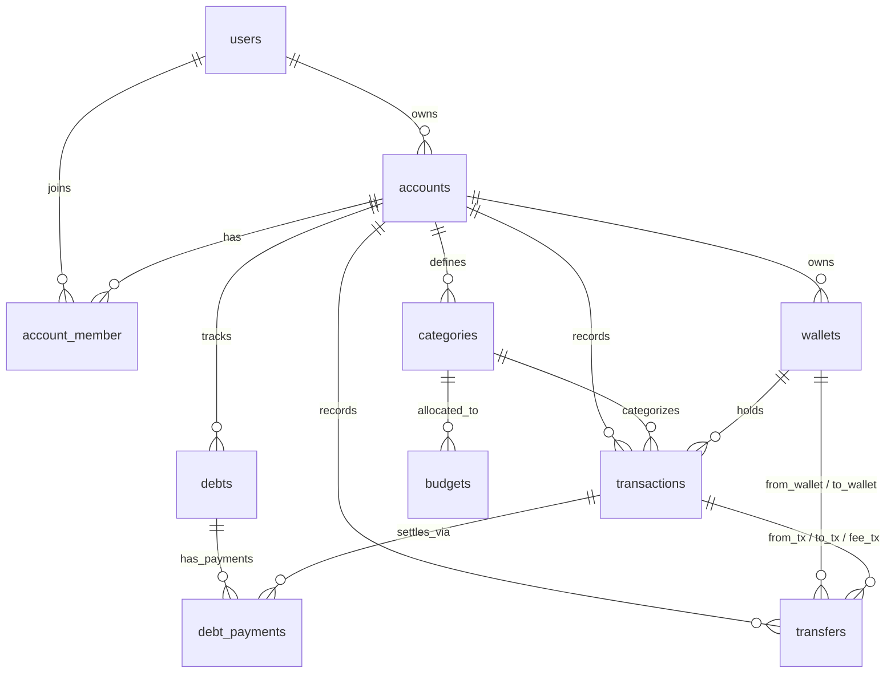

# Database Specification - DompetKita

Dokumen ini mendokumentasikan spesifikasi basis data, relasi, batasan (*constraints*), dan *database triggers* untuk aplikasi **DompetKita**.

---

## 1. Overview Entitas & Relasi

Aplikasi DompetKita mengadopsi model **multi-tenant berbasis akun (`accounts`)**. Seorang pengguna (`users`) dapat memiliki beberapa akun (misal: "Keuangan Pribadi" dan "Keuangan Keluarga"), serta dapat mengundang pengguna lain sebagai anggota (`account_member`) dengan peran (*role*) tertentu.

---

## 2. Kamus Data (Data Dictionary)

### 2.1. `users`
Menyimpan data identitas pengguna dan kredensial autentikasi.

| Kolom | Tipe Data | Nullable | Index / Constraint | Keterangan |
| :--- | :--- | :--- | :--- | :--- |
| `id` | `BIGSERIAL` / `BIGINT` | No | Primary Key | ID Pengguna |
| `created_at` | `TIMESTAMP` | No | - | Waktu pembuatan |
| `updated_at` | `TIMESTAMP` | No | - | Waktu update terakhir |
| `name` | `VARCHAR(255)` | No | INDEX | Nama lengkap pengguna |
| `email` | `VARCHAR(255)` | No | UNIQUE, INDEX | Alamat email (login) |
| `password` | `VARCHAR(255)` | No | - | Hash sandi (bcrypt/argon2) |
| `two_factor_secret` | `TEXT` | Yes | - | Secret key TOTP 2FA |
| `two_factor_recovery_codes` | `TEXT` | Yes | - | Kode pemulihan darurat 2FA (JSON/encrypted) |
| `two_factor_confirmed_at` | `TIMESTAMP` | Yes | - | Waktu aktivasi 2FA dikonfirmasi |

---

### 2.2. `accounts`
Entitas pembungkus ruang lingkup keuangan (*tenant boundary*).

| Kolom | Tipe Data | Nullable | Index / Constraint | Keterangan |
| :--- | :--- | :--- | :--- | :--- |
| `id` | `BIGSERIAL` / `BIGINT` | No | Primary Key | ID Akun |
| `created_at` | `TIMESTAMP` | No | - | Waktu pembuatan |
| `updated_at` | `TIMESTAMP` | No | - | Waktu update terakhir |
| `deleted_at` | `TIMESTAMP` | Yes | INDEX | Soft deletes |
| `owner_id` | `BIGINT` | No | FK $\rightarrow$ `users.id` | Pemilik utama akun |
| `name` | `VARCHAR(255)` | No | INDEX | Nama akun (misal: "Keuangan Rumah Tangga") |
| `slug` | `VARCHAR(255)` | No | UNIQUE | URL-friendly slug |
| `description` | `TEXT` | Yes | - | Deskripsi tambahan akun |

---

### 2.3. `account_member`
Relasi kolaborasi multi-user ke dalam suatu akun.

| Kolom | Tipe Data | Nullable | Index / Constraint | Keterangan |
| :--- | :--- | :--- | :--- | :--- |
| `created_at` | `TIMESTAMP` | No | - | Waktu pembuatan |
| `updated_at` | `TIMESTAMP` | No | - | Waktu update terakhir |
| `account_id` | `BIGINT` | No | FK $\rightarrow$ `accounts.id` | Akun terkait |
| `user_id` | `BIGINT` | No | FK $\rightarrow$ `users.id` | Pengguna yang diundang/bergabung |
| `invited_at` | `TIMESTAMP` | Yes | INDEX | Waktu undangan dikirim |
| `confirmed_at` | `TIMESTAMP` | Yes | INDEX | Waktu undangan diterima |
| `left_at` | `TIMESTAMP` | Yes | INDEX | Waktu keluar dari akun |
| `revoked_at` | `TIMESTAMP` | Yes | INDEX | Waktu akses dicabut oleh owner |
| `role` | `VARCHAR(20)` | No | INDEX | Enum: `owner`, `member`, `viewer` |
| `status` | `VARCHAR(20)` | No | INDEX | Enum: `invited`, `active`, `left`, `revoked` |

* **Constraint Unik:** `UNIQUE(account_id, user_id)`

---

### 2.4. `categories`
Kategori transaksi untuk pengeluaran atau pemasukan.

| Kolom | Tipe Data | Nullable | Index / Constraint | Keterangan |
| :--- | :--- | :--- | :--- | :--- |
| `id` | `BIGSERIAL` / `BIGINT` | No | Primary Key | ID Kategori |
| `created_at` | `TIMESTAMP` | No | - | Waktu pembuatan |
| `updated_at` | `TIMESTAMP` | No | - | Waktu update terakhir |
| `deleted_at` | `TIMESTAMP` | Yes | INDEX | Soft deletes |
| `account_id` | `BIGINT` | No | FK $\rightarrow$ `accounts.id` | Akun pemilik kategori |
| `is_system` | `BOOLEAN` | No | INDEX | Penanda kategori bawaan sistem / kustom user |
| `name` | `VARCHAR(255)` | No | INDEX | Nama kategori (misal: "Gaji", "Makan & Minum") |
| `type` | `VARCHAR(20)` | No | INDEX | Enum: `income`, `expense` |
| `slug` | `VARCHAR(255)` | No | UNIQUE | Identifier slug |
| `icon` | `VARCHAR(100)` | Yes | INDEX | Nama icon (Lucide / Iconify) |
| `color` | `VARCHAR(50)` | Yes | INDEX | Kode hex warna kategori |
| `order` | `BIGINT` | No | INDEX | Urutan tampilan |
| `status` | `VARCHAR(20)` | No | - | Enum: `active`, `inactive` |

* **Constraint Unik:** `UNIQUE(account_id, name, deleted_at)`

---

### 2.5. `budgets`
Alokasi anggaran batas pengeluaran per kategori dalam periode tertentu.

| Kolom | Tipe Data | Nullable | Index / Constraint | Keterangan |
| :--- | :--- | :--- | :--- | :--- |
| `id` | `BIGSERIAL` / `BIGINT` | No | Primary Key | ID Budget |
| `created_at` | `TIMESTAMP` | No | - | Waktu pembuatan |
| `updated_at` | `TIMESTAMP` | No | - | Waktu update terakhir |
| `category_id` | `BIGINT` | No | FK $\rightarrow$ `categories.id` | Kategori yang dianggarkan |
| `max_amount` | `DECIMAL(24, 2)` | No | INDEX | Batas maksimal dana (harus $\ge 0$) |
| `alert_percentage` | `SMALLINT` | No | - | Persentase peringatan (contoh: 80%) |
| `period_type` | `VARCHAR(20)` | No | INDEX | Enum: `weekly`, `monthly`, `yearly` |
| `period_start` | `TIMESTAMP` | No | - | Waktu mulai periode |
| `period_end` | `TIMESTAMP` | No | - | Waktu berakhir periode (`period_end > period_start`) |

---

### 2.6. `wallets`
Penyimpanan sumber dana / rekening (bank, e-wallet, uang tunai, investasi).

| Kolom | Tipe Data | Nullable | Index / Constraint | Keterangan |
| :--- | :--- | :--- | :--- | :--- |
| `id` | `BIGSERIAL` / `BIGINT` | No | Primary Key | ID Wallet |
| `created_at` | `TIMESTAMP` | No | - | Waktu pembuatan |
| `updated_at` | `TIMESTAMP` | No | - | Waktu update terakhir |
| `deleted_at` | `TIMESTAMP` | Yes | INDEX | Soft deletes |
| `account_id` | `BIGINT` | No | FK $\rightarrow$ `accounts.id` | Akun pemilik wallet |
| `name` | `VARCHAR(255)` | No | INDEX | Nama dompet (misal: "Bank BCA", "Dompet Tunai") |
| `slug` | `VARCHAR(255)` | No | UNIQUE | Identifier slug |
| `icon` | `VARCHAR(100)` | Yes | - | Icon wallet |
| `color` | `VARCHAR(50)` | Yes | - | Warna identitas wallet |
| `current_balance` | `DECIMAL(24, 2)` | No | INDEX | Saldo saat ini (disinkronisasi otomatis via Trigger) |
| `allow_minus` | `BOOLEAN` | No | INDEX, DEFAULT(0) | Apakah saldo diizinkan bernilai negatif |

---

### 2.7. `transactions`
Catatan mutasi pemasukan, pengeluaran, atau transaksi transfer.

| Kolom | Tipe Data | Nullable | Index / Constraint | Keterangan |
| :--- | :--- | :--- | :--- | :--- |
| `id` | `BIGSERIAL` / `BIGINT` | No | Primary Key | ID Transaksi |
| `created_at` | `TIMESTAMP` | No | - | Waktu pembuatan record |
| `updated_at` | `TIMESTAMP` | No | - | Waktu update record |
| `account_id` | `BIGINT` | No | FK $\rightarrow$ `accounts.id` | Akun pemilik transaksi |
| `category_id` | `BIGINT` | No | FK $\rightarrow$ `categories.id` | Kategori transaksi |
| `wallet_id` | `BIGINT` | No | FK $\rightarrow$ `wallets.id` | Dompet yang terkena mutasi |
| `happened_at` | `TIMESTAMP` | No | INDEX | Tanggal dan waktu aktual transaksi terjadi |
| `category_name` | `VARCHAR(255)` | No | - | Snapshot nama kategori saat transaksi dibuat |
| `wallet_name` | `VARCHAR(255)` | No | - | Snapshot nama dompet saat transaksi dibuat |
| `wallet_balance_before` | `DECIMAL(24, 2)` | No | INDEX | Saldo dompet sebelum transaksi |
| `amount` | `DECIMAL(24, 2)` | No | INDEX | Nilai transaksi (selalu positif) |
| `wallet_balance_after` | `DECIMAL(24, 2)` | No | INDEX | Saldo dompet setelah transaksi |
| `direction` | `SMALLINT` | No | INDEX | `1` = Pemasukan (Income), `-1` = Pengeluaran (Expense) |
| `type` | `VARCHAR(20)` | No | INDEX | Enum: `transaction` (biasa), `transfer` |
| `note` | `TEXT` | Yes | - | Catatan detail transaksi |

---

### 2.8. `transfers`
Pencatatan perpindahan dana antar-dompet.

| Kolom | Tipe Data | Nullable | Index / Constraint | Keterangan |
| :--- | :--- | :--- | :--- | :--- |
| `id` | `BIGSERIAL` / `BIGINT` | No | Primary Key | ID Transfer |
| `created_at` | `TIMESTAMP` | No | - | Waktu pembuatan |
| `updated_at` | `TIMESTAMP` | No | - | Waktu update terakhir |
| `account_id` | `BIGINT` | No | FK $\rightarrow$ `accounts.id` | Akun pemilik transfer |
| `from_wallet_id` | `BIGINT` | No | FK $\rightarrow$ `wallets.id` | Dompet asal |
| `to_wallet_id` | `BIGINT` | No | FK $\rightarrow$ `wallets.id` | Dompet tujuan |
| `from_transaction_id` | `BIGINT` | No | FK $\rightarrow$ `transactions.id` | ID transaksi pengeluaran dari dompet asal |
| `to_transaction_id` | `BIGINT` | No | FK $\rightarrow$ `transactions.id` | ID transaksi pemasukan ke dompet tujuan |
| `fee_transaction_id` | `BIGINT` | Yes | FK $\rightarrow$ `transactions.id` | ID transaksi biaya admin transfer (opsional) |
| `happened_at` | `TIMESTAMP` | No | INDEX | Waktu transfer terjadi |
| `amount` | `DECIMAL(24, 2)` | No | INDEX | Nominal transfer |
| `fee_amount` | `DECIMAL(24, 2)` | No | INDEX, DEFAULT(0) | Nominal biaya transfer |
| `note` | `TEXT` | Yes | - | Catatan transfer |

---

### 2.9. `debts`
Pencatatan utang (kewajiban kita) dan piutang (hak kita dari pihak lain).

| Kolom | Tipe Data | Nullable | Index / Constraint | Keterangan |
| :--- | :--- | :--- | :--- | :--- |
| `id` | `BIGSERIAL` / `BIGINT` | No | Primary Key | ID Utang/Piutang |
| `created_at` | `TIMESTAMP` | No | - | Waktu pembuatan |
| `updated_at` | `TIMESTAMP` | No | - | Waktu update |
| `deleted_at` | `TIMESTAMP` | Yes | INDEX | Soft deletes |
| `account_id` | `BIGINT` | No | FK $\rightarrow$ `accounts.id` | Akun terkait |
| `counterparty_name` | `VARCHAR(255)` | No | INDEX | Nama pihak kedua (debitur/kreditur) |
| `type` | `VARCHAR(20)` | No | INDEX | Enum: `payable` (utang), `receivable` (piutang) |
| `initial_amount` | `DECIMAL(24, 2)` | No | INDEX | Nilai total pokok awal |
| `paid_amount` | `DECIMAL(24, 2)` | No | INDEX, DEFAULT(0) | Total nominal yang sudah dibayar |
| `due_date` | `TIMESTAMP` | No | INDEX | Tanggal jatuh tempo |
| `note` | `TEXT` | Yes | - | Catatan utang/piutang |

---

### 2.10. `debt_payments`
Pencatatan riwayat cicilan/pelunasan utang dan piutang.

| Kolom | Tipe Data | Nullable | Index / Constraint | Keterangan |
| :--- | :--- | :--- | :--- | :--- |
| `id` | `BIGSERIAL` / `BIGINT` | No | Primary Key | ID Cicilan |
| `created_at` | `TIMESTAMP` | No | - | Waktu pembuatan |
| `updated_at` | `TIMESTAMP` | No | - | Waktu update |
| `debt_id` | `BIGINT` | No | FK $\rightarrow$ `debts.id` | Utang/piutang yang dibayar |
| `transaction_id` | `BIGINT` | No | FK $\rightarrow$ `transactions.id` | Transaksi mutasi keuangan yang terjadi |
| `paid_at` | `TIMESTAMP` | No | INDEX | Waktu pembayaran dilakukan |
| `amount` | `DECIMAL(24, 2)` | No | DEFAULT(0) | Nominal yang dibayar pada cicilan ini |

---

### 2.11. `attachments`
Penyimpanan metadata lampiran file (*polymorphic*).

| Kolom | Tipe Data | Nullable | Index / Constraint | Keterangan |
| :--- | :--- | :--- | :--- | :--- |
| `id` | `BIGSERIAL` / `BIGINT` | No | Primary Key | ID Lampiran |
| `created_at` | `TIMESTAMP` | No | - | Waktu upload |
| `updated_at` | `TIMESTAMP` | No | - | Waktu update |
| `deleted_at` | `TIMESTAMP` | Yes | INDEX | Soft deletes |
| `attachable_type` | `VARCHAR(100)` | No | INDEX | Model/entitas induk (misal: "transaction", "debt") |
| `attachable_id` | `BIGINT` | No | INDEX | ID dari model induk |
| `file_path` | `TEXT` | No | - | Path file di storage lokal / object storage S3 |
| `mime_type` | `VARCHAR(100)` | No | INDEX | MIME type file (misal: `image/jpeg`, `application/pdf`) |
| `size` | `BIGINT` | No | INDEX | Ukuran file dalam bytes |

---

## 3. Database Triggers & Aturan Konsistensi Finansial

1. **Trigger Sinkronisasi Saldo Wallet (`wallets.current_balance`):**
   * Setiap kali `transactions` ditambahkan (`AFTER INSERT`), saldo `wallets.current_balance` bertambah sebesar `amount * direction`.
   * Jika `wallets.allow_minus = FALSE` dan saldo akhir $< 0$, operasi dibatalkan (*abort transaction / raise exception*).
   * Pada aksi `AFTER UPDATE` atau `AFTER DELETE` transaksi, saldo wallet disesuaikan secara proporsional.

2. **Trigger Agregasi Pelunasan Hutang (`debts.paid_amount`):**
   * Setiap ada `debt_payments` baru, nilai `debts.paid_amount` dihitung ulang secara atomik (`SUM(amount)` dari semua cicilan aktif pada `debt_id` terkait).
