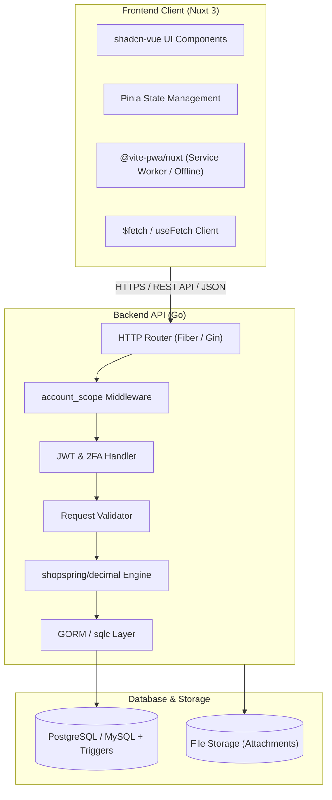

# Product Requirements Document (PRD) - DompetKita

**Nama Aplikasi:** DompetKita  
**Tujuan:** Aplikasi pencatatan & manajemen keuangan cerdas untuk kebutuhan pribadi, rumah tangga, maupun komunitas kecil berbasis multi-akun & kolaborasi keluarga.

---

## 1. Ikhtisar & Fitur Utama

* **Multi-Account Management:** Satu user dapat memiliki dan berpindah antar banyak akun (contoh: *Keuangan Pribadi*, *Keuangan Rumah Tangga*, *Bisnis Sampingan*).
* **Family / Member Collaboration:** Mengundang anggota keluarga (suami, istri, atau partner) ke dalam akun bersama dengan pembagian peran (*Owner*, *Member*, *Viewer*).
* **Multi-Wallet Tracking:** Mencatat berbagai sumber kas dan bank (Bank BCA, SeaBank, Dompet Tunai, Tabungan Investasi) dengan saldo real-time.
* **Kategori & Penganggaran (Budgeting):** Pengelompokan pengeluaran/pemasukan fleksibel disertai sistem peringatan (*early alert*) sebelum pengeluaran melebihi batas anggaran bulanan/mingguan/tahunan.
* **Transfer Dana & Biaya Admin:** Pencatatan transfer antar dompet lengkap dengan pelacakan mutasi debit/kredit dan pencatatan biaya transfer (*admin fee*).
* **Pelacakan Hutang & Piutang (Debts):** Manajemen utang/piutang dilengkapi tanggal jatuh tempo dan pencatatan cicilan/pelunasan bertahap.
* **Bukti Transaksi (Attachments):** Upload nota, struk belanja, atau bukti transfer pada transaksi keuangan.

---

## 2. Arsitektur & Tech Stack

### 2.1. Frontend Core (Nuxt 3)
* **Framework:** Nuxt 3 (berbasis Vue 3 Composition API & TypeScript).
* **Rendering & Navigation:** Nuxt File-Based Routing & Layouts dengan automatic code splitting untuk performa loading secepat kilat.
* **State Management:** Pinia (via `@pinia/nuxt`) untuk caching state akun aktif, daftar dompet, dan autentikasi.
* **UI & Styling:** 
  * `shadcn-vue` (berbasis Radix Vue primitives) untuk komponen antarmuka yang bersih, mudah diakses (*accessible*), dan modern.
  * Tailwind CSS (via `@nuxtjs/tailwindcss`) dengan utilitas responsif menyeluruh.
* **HTTP Client:** `$fetch` / `useFetch` bawaan Nuxt dengan konfigurasi interceptor untuk auto-inject token, penyegaran token otomatis (*refresh token*), dan manajemen error terpusat.

### 2.2. Backend Core (Go RESTful API)
* **Bahasa & Framework:** Go (Golang) menggunakan framework HTTP berkecepatan tinggi (**Go Fiber** atau **Gin**).
* **Database & Migration:** PostgreSQL atau MySQL dengan `golang-migrate` / GORM untuk versioned migration.
* **Presisi Finansial:** Menggunakan library [`github.com/shopspring/decimal`](https://github.com/shopspring/decimal) untuk seluruh operasi angka uang (`decimal(24, 2)`), mencegah potensi kehilangan presisi floating point.
* **Validasi Data:** `go-playground/validator` untuk memastikan validitas payload request sebelum dieksekusi.

### 2.3. Mobile & Desktop Experience
* **Mobile-First UX:**
  * Komponen *Bottom Sheet* / Drawer (`shadcn-vue Sheet`) untuk aksi cepat seperti tambah transaksi.
  * *Custom Bottom Navigation Bar* di tampilan smartphone untuk navigasi satu tangan (*thumb-friendly*).
* **Progressive Web App (PWA):** Modul `@vite-pwa/nuxt` untuk instalasi aplikasi seperti native app, web app manifest, service worker, dan caching offline dasar.
* **Responsif:** Tampilan adaptif otomatis dari layar smartphone 320px, tablet, laptop, hingga monitor 4K.

---

## 3. Keamanan, Multi-Akun & Role-Based Access Control (RBAC)

### 3.1. Middleware `account_scope`
Setiap request ke sumber daya yang berada di dalam lingkup akun wajib menyertakan header `X-Account-Id`:
1. Middleware Go memvalidasi apakah user yang sedang login terdaftar dan berstatus `active` di tabel `account_member` untuk akun tersebut.
2. Menyematkan objek `Account` dan `Role` ke dalam context request.
3. Menolak request dengan status `403 Forbidden` jika pengguna tidak memiliki izin ke akun tersebut.

### 3.2. Hak Akses Berdasarkan Role
* **Owner:** Kuasa penuh pada akun (mengubah pengaturan akun, mengundang/menghapus member, mengelola semua transaksi, kategori, budget, dan dompet).
* **Member:** Dapat membuat, melihat, mengubah transaksi, transfer, kategori, dan mencatat hutang/piutang. Tidak dapat menghapus akun atau mengelola peran anggota lain.
* **Viewer:** Hanya memiliki hak baca (*read-only*) untuk melihat ringkasan keuangan, riwayat transaksi, dan laporan.

### 3.3. Autentikasi & Keamanan Tambahan
* **JWT Auth:** Pasangan Access Token (disimpan di memory/header) dan Refresh Token (dalam HTTP-Only, Secure, SameSite Cookie).
* **Two-Factor Authentication (2FA):** Standar TOTP (Google Authenticator / Authy) disertai kode cadangan darurat (*recovery codes*).
* **Rate Limiting:** Pembatasan frekuensi request pada endpoint sensitif (login, transaksi, transfer, upload file).
* **Proteksi File:** Validasi tipe MIME dan batasan ukuran file saat upload attachment.

---

## 4. Basis Data

Spesifikasi detail mengenai tabel, kolom, relasi, tipe data, indeks, dan *database triggers* didokumentasikan secara terpisah pada:
👉 [**Spesifikasi Database (docs/DATABASE.md)**](file:///D:/Rafy/www/dompetkita/docs/DATABASE.md)
